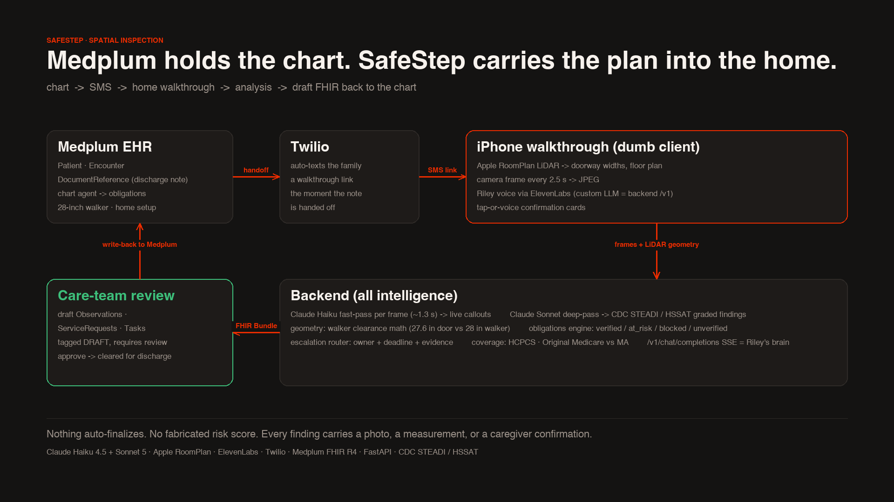
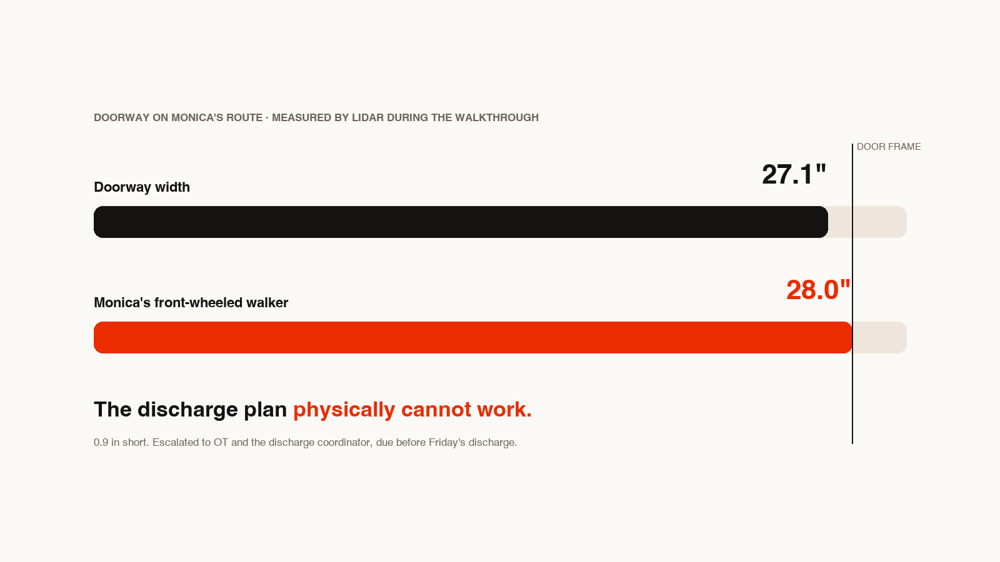

# SafeStep Ready: verify the home before discharge

**Medplum holds the chart. Twilio texts the family a walkthrough link. Riley (ElevenLabs) guides the iPhone walk while Claude analyzes every frame live. SafeStep writes draft FHIR and Medicare coverage back to Medplum before the patient leaves.**



> *Monica's clinical team believes she may be ready to go home. SafeStep answers
> the question her chart cannot: **is her home ready for her?***

Built at the **Multi-Agent Hackathon** (September 13, 2026).

Every discharge plan ends with some version of *"discharge home once safe"*, but
nobody can verify "safe" from the chart. Falls after discharge are a leading
driver of readmissions; home-safety evaluations (CDC STEADI, HSSAT) exist but
need a clinician home visit that rarely happens. SafeStep turns any caregiver
with a LiDAR iPhone into that visit, run by a team of agents, and closes the loop
back into **Medplum** before the patient leaves.

## The demo story (chart, then home, then chart)

1. **Clinician portal (Medplum)**: Monica Hilpert, 76F: osteoporosis, deconditioned
   after a week in hospital and SNF rehab, lives alone, uses a **28-inch**
   front-wheeled walker, going home Friday. Her encounter note's discharge-planning
   line is highlighted, *"formal pre-discharge assessment of ... home setup"*, and
   handed to SafeStep. The chart agent reads Patient, Encounter, and DocumentReference
   (discharge note + after-visit summary) and derives post-encounter obligations:
   walker clearance, grab bars, night lighting, no stairs, support at home.
2. **Twilio**: the moment the note is handed off, SafeStep texts the family a link.
   Nobody has to remember to send it. Anyone at the apartment opens it on an iPhone.
3. **The walkthrough**: **Riley** (ElevenLabs voice) guides room to room in
   *gathering mode*: neutral questions only, no hazard lecture to laypeople. Three
   perception layers run at the same time:
   - **Apple RoomPlan LiDAR**: rooms, doorways, furniture, plus live AR detection
     boxes on screen (YOLOv3 on the Neural Engine).
   - **Claude Haiku fast-pass** per camera frame (~1.3 s) feeding Riley live scan events.
   - **Claude Sonnet deep-pass** grading CDC STEADI / HSSAT findings in the background.
   Confirmation cards resolve by tap or voice. The iPhone is a dumb client; all
   intelligence is on the backend. Riley's LLM *is* this backend
   (`/v1/chat/completions`, SSE): the same model that sees camera events and the
   Medplum note writes Riley's next sentence.
4. **The verdict**: SafeStep scores every obligation from the note against walkthrough
   evidence (`verified / at_risk / blocked / unverified`). The killer finding is a
   measurement, not a vibe: **"The bathroom doorway is 27.1 in. Monica's walker is 28.
   The discharge plan as written will not work."**

   
5. **Care-team review in Medplum**: drafted actions (clinical / operational / DME, each
   with owner, deadline, and evidence) await clinician approval, next to the floor plan
   with the failing door in red, the photo filmstrip, and the full graded report. Each
   DME ServiceRequest carries an **HCPCS** code and a **Medicare coverage note**
   (Original Medicare vs Medicare Advantage / waiver / self-pay). Approve, remediation
   verified, **chart updates: "VERIFIED, cleared for discharge."**

Nothing downstream of the camera is faked: every model call happens live. There is
deliberately **no fabricated risk score** anywhere; findings are graded against CDC
STEADI / HSSAT items with per-patient rationale, and all orders and escalations are
**drafted, never auto-sent**.

## The three agents

| Agent | Does | Code |
| --- | --- | --- |
| **Vision agent** | Claude Haiku fast-pass per frame for live callouts; Claude Sonnet deep-pass grades STEADI / HSSAT findings with photo evidence | `backend/vision.py`, `backend/prompts.py` |
| **Geometry agent** | RoomPlan LiDAR mesh in, doorway and opening widths out; walker-clearance math (27.1 in door vs 28.0 in walker); floor plan with the failing door in red | `backend/geometry.py`, `backend/floorplan.py`, `iphone/Sources/RoomScanner.swift` |
| **Arbitration agent** | Scores every discharge-note obligation, routes each fix to OT / social work / care team / caregiver with owner and deadline, drafts FHIR Observations, ServiceRequests (HCPCS + coverage) and Tasks | `backend/obligations.py`, `backend/escalations.py`, `backend/journey.py`, `backend/fhir_writeback.py` |

Riley's voice brain is the same backend: `POST /v1/chat/completions` (SSE) in
`backend/brain.py`, the custom-LLM URL of the ElevenLabs conversational agent.

## Architecture

```
iPhone (dumb client)                        Backend (all intelligence)
+----------------------------+           +------------------------------------+
| RoomPlan LiDAR scan        |- geometry >| /roomplan  walker-clearance math,  |
|  + live AR detection boxes |           |            floor-plan rendering    |
| ARSession frames (2.5 s)   |- JPEG ---->| /frame     Haiku fast-pass --+     |
| ElevenLabs voice (WebRTC)  |           |            Sonnet deep-pass  |     |
| confirmation cards         |           |  events + measurements <-----+     |
+-----------+----------------+           |      v                             |
            |                            | /v1/chat/completions  (SSE brain)  |
  ElevenLabs cloud - custom LLM -------->| obligations engine <- Medplum note |
            (via ngrok)                  | escalation router     + AVS        |
                                         | coverage (HCPCS / Medicare)        |
                                         | /report . /approvals . FHIR drafts |
                                         | Bundle -> Medplum PIMS             |
                                         +------------------------------------+
Medplum  DocumentReference.search --------> chart agent
Twilio   Messages.create ------------------> family iPhone (walkthrough link)
```

- **One brain**: the ElevenLabs agent's LLM is this backend. The same model that sees
  the camera events and the chart writes Riley's next sentence.
- **Obligations engine**: derives post-encounter obligations from the Medplum discharge
  note + after-visit summary, then scores each `verified / at_risk / blocked / unverified`
  against walkthrough evidence (`backend/obligations.py`).
- **Escalation router**: deterministic rules produce routed messages (expected /
  observed / why / attempted / next action, plus owner and deadline). DME that Original
  Medicare does not cover routes to social work (`backend/escalations.py`).
- **FHIR write-back (draft)**: Observations (hazards), ServiceRequests (DME with HCPCS +
  coverage flags), Tasks (escalations), all tagged `DRAFT, requires clinician review`
  (`backend/fhir_writeback.py`).

### Coverage catalog

From `backend/fhir_writeback.py` `DME_CATALOG`. Keys match substrings of the
recommendation text; `"walker"` alone is not a trigger because Monica already owns one,
only `"replacement walker"` is.

| Item | HCPCS | Original Medicare / insurance |
| --- | --- | --- |
| Bathtub wall rail / grab bar | E0241 | Not covered by Original Medicare; often MA supplemental or state waiver, routed to social work |
| Bath/shower chair | E0240 | Not covered by Original Medicare; low-cost self-pay; MA plans often cover |
| Raised toilet seat | E0244 | Not covered by Original Medicare; MA supplemental often covers |
| Folding wheeled walker (replacement) | E0143 | Covered by Medicare Part B as DME with physician order |
| Bedside commode | E0163 | Covered by Medicare Part B when the patient is room-confined |
| Night lights / motion-sensor lighting | (none) | Home modification, routed to OT / social work |
| Offset hinges / door widening | E1399 | Home modification, not standard Part B DME; reviewed in Medplum |

Monica's blocked bathroom door (27.1 in vs 28 in walker) drafts E1399 with OT + social
work, optional E0143 only if the door cannot be widened, E0241 grab bars (not Original
Medicare), and E0163 if she would be room-confined.

## Reliability evaluation

`backend/evaluation.py` measures the deterministic agents against simulated RoomPlan
exports with known ground truth, and exercises the Medplum and Twilio request contracts
against stateful in-process twins. No keys, no network, about 0.1 s.

```bash
cd backend && python evaluation.py --suite lidar_50 --twins medplum,twilio
python evaluation.py --suite lidar_500 --seed 7 --out ../docs/eval-baseline.json
```

| Suite | What is asserted |
| --- | --- |
| **geometry** | Door widths cluster on real US interior doors (24-36 in) with edge cases at the 29.0 in decision boundary (28.9 / 29.0 / 29.1), 72-96 in openings that must classify as spans, malformed `width_m` entries, exact m-to-in conversion. Precision and recall of the walker-clearance verdict. |
| **escalations** | Failing door routes to `OT + discharging MD` with a pre-discharge deadline; critical hazard routes to the discharge coordinator; DME not covered by Original Medicare routes to social work; routine PT/OT item always present; order is clinical, operational, social, routine; no clinical escalation without a failing door. |
| **fhir** | Every Bundle is `Bundle` with the `DRAFT` tag; entries are Observation / ServiceRequest / Task referencing `Patient/...`; ServiceRequests are `draft` / `proposal`; every HCPCS code is in the catalog; E0143 only when a replacement walker was actually recommended. |
| **twins** | Medplum twin accepts only a well-formed FHIR Bundle (201, else 422 / 400) and stores resources. Twilio twin enforces `Messages.create`: E.164 To and From, non-empty body up to 1600 chars (201, else 400), plus negative controls that must be rejected. |

Baseline, committed at [`docs/eval-baseline.json`](docs/eval-baseline.json)
(`--suite lidar_500 --seed 7`):

```
[geometry]    doors=1319 blocked=480 flagged=480 precision=1.000 recall=1.000 spans 172/172 max unit error 0.0 in
[escalations] 2500/2500 routing assertions
[fhir]        bundles=500 malformed=0 status_errors=0 unknown_hcpcs=0 walker_catalog_errors=0 medplum_twin 500/500 201
[twilio]      twin 500/500 201 . negative controls rejected 3/3
[eval] 6994 assertions . 0 failed . 100.0% . 0.07s
```

Stable across seeds 7, 99 and 20260913. The suite is sensitive: injecting an
off-by-margin bug (treating 28.0-28.9 in doors as clear) drops recall to 0.70 with 144
false negatives on the same 500 meshes. The Claude passes (vision fast and deep pass,
obligation scoring) are exercised by replaying a real walkthrough through the live
pipeline with `backend/prepare_demo.py`, not by this suite.

## Repo layout

| Path | What |
| --- | --- |
| `backend/` | FastAPI: `/frame`, `/roomplan`, `/v1/chat/completions`, obligations, escalations, FHIR drafts + `DME_CATALOG`, report, floor plan, demo replay, evaluation |
| `iphone/` | iPhone client: RoomPlan LiDAR, AR detection boxes, confirmation cards, Riley session |
| `web/` | Next.js care-team surfaces: Medplum chart view, iPhone walk, write-back review with the Medicare table |
| `docs/` | Architecture card, doorway measurement card, full sample report (27 findings, photos, floor plan), eval baseline |
| `synthetic-ambient-fhir-25/` | Encounter artifacts used to seed Monica's note (synthetic, Synthea) |
| `LIVE_DEMO_PLAN.md` | Three-minute run of show, failure ladder, rehearsal checklist |
| `RELAY_CONCEPT.md` | Product thesis: care-plan execution after the encounter |

## Run it

```bash
# backend (Mac)
python3 -m venv .venv && .venv/bin/pip install -r backend/requirements.txt
cp .env.example .env            # Anthropic, Medplum, Twilio, ElevenLabs keys
cd backend && ../.venv/bin/uvicorn app:app --host 0.0.0.0 --port 8000

# voice plumbing: ngrok http 8000, then point the ElevenLabs conversational
# agent's custom-LLM URL at https://<ngrok>/v1   (SSE streaming)

# iPhone (LiDAR: iPhone 12 Pro or later, iPad Pro)
cd iphone && ./fetch-models.sh  # on-device YOLOv3 (59 MB, not committed) — run before xcodegen
xcodegen generate && open Walkthrough.xcodeproj
# set your signing team in Xcode; set the Mac's LAN IP in Sources/BackendClient.swift

# web (care-team surfaces)
cd web && npm install && npm run dev      # http://127.0.0.1:43127

# demo mode (no home needed): feed any walkthrough recording through the live
# pipeline: backend/prepare_demo.py <video>, then "replay" in the app
```

Care-team surfaces from the backend: `http://<mac>:8000/` (run index), `/report`,
`/report/fhir`, `/floorplan`. A fully rendered sample report is at
[docs/sample-report.html](docs/sample-report.html).

### Configuration

| Service | Keys in `.env` | Used for |
| --- | --- | --- |
| Anthropic | `ANTHROPIC_API_KEY` | Haiku fast-pass, Sonnet deep-pass, obligation scoring, Riley's brain |
| Medplum | `MEDPLUM_BASE_URL`, `MEDPLUM_CLIENT_ID`, `MEDPLUM_CLIENT_SECRET` | Patient, Encounter, DocumentReference in; draft Bundle back |
| Twilio | `TWILIO_ACCOUNT_SID`, `TWILIO_AUTH_TOKEN`, `TWILIO_FROM`, `TWILIO_TO` | Text the family the walkthrough link on handoff |
| ElevenLabs | `ELEVENLABS_API_KEY`, `ELEVENLABS_AGENT_ID` | Riley, custom LLM pointed at the backend `/v1` |

## Built with

Claude (Haiku 4.5 fast-pass, Sonnet 5 deep-pass and voice brain) · Apple RoomPlan and
Core ML (YOLOv3) · ElevenLabs Conversational AI · Twilio · Medplum (FHIR R4) · FastAPI ·
Next.js · CDC STEADI / HSSAT.

Synthetic data only; not a medical device. All patient data in this repo and demo is
fully synthetic (Synthea).
