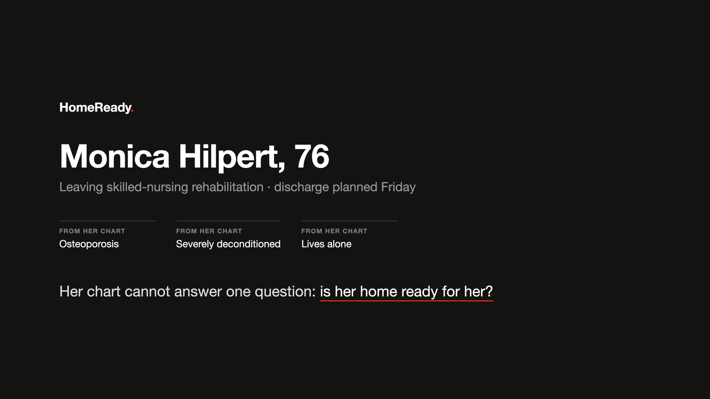
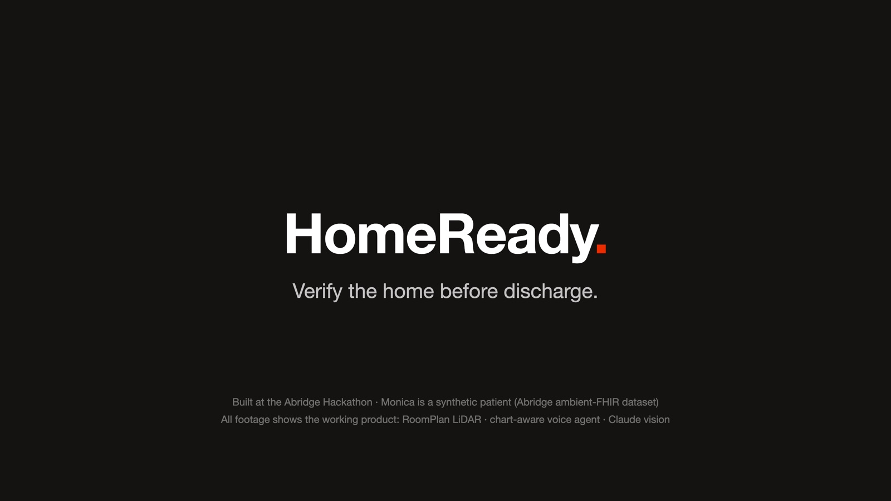

# SafeStep Ready — verify the home before discharge

**Medplum holds the chart. Twilio auto-texts the family a walkthrough link. Riley (ElevenLabs voice, Vapi optional) guides the iPhone scan while Claude analyzes frames live. SafeStep writes draft FHIR + Medicare/insurance coverage back to Medplum (EHR / PIMS).**


## The three agents in the video, mapped to code

| Agent (video) | Does | Code |
| --- | --- | --- |
| **Vision agent** | Claude Haiku fast-pass per frame (~1.3 s) for live callouts; Claude Sonnet deep-pass grades CDC STEADI / HSSAT findings with photo evidence | `engine/backend/vision.py`, `prompts.py` |
| **Geometry agent** | RoomPlan LiDAR mesh in, doorway and opening widths out; walker-clearance math (bathroom door 27.1 in vs 28.0 in walker); floor plan with the failing door in red | `engine/backend/geometry.py`, `floorplan.py`, `engine/iphone/Sources/RoomScanner.swift` |
| **Arbitration agent** | Scores every discharge-note obligation `verified / at_risk / blocked / unverified`, routes each fix to OT / social work / care team / caregiver with owner + deadline, drafts FHIR Observations, ServiceRequests (HCPCS + Medicare coverage) and Tasks | `engine/backend/obligations.py`, `escalations.py`, `journey.py`, `fhir_writeback.py` |

Riley's voice brain is the same backend: `POST /v1/chat/completions` (SSE) in `engine/backend/brain.py`, pointed at by the ElevenLabs (or Vapi) agent's custom-LLM URL.

## What runs live today vs. what is scripted

| Layer | Status | Where |
| --- | --- | --- |
| Apple RoomPlan LiDAR scan, doorway widths, floor plan, AR boxes | **Live** on a LiDAR iPhone | `engine/iphone/Sources/RoomScanner.swift`, `LiveDetection.swift` |
| Claude Haiku fast-pass per frame, Claude Sonnet deep-pass (STEADI/HSSAT), obligations scoring, Riley brain (`/v1/chat/completions` SSE) | **Live** with `ANTHROPIC_API_KEY` | `engine/backend/vision.py`, `brain.py`, `obligations.py` |
| Walker-clearance math, escalation router, HCPCS / Medicare coverage table, draft FHIR Bundle, clinician report + approvals | **Live** (deterministic) | `engine/backend/geometry.py`, `escalations.py`, `fhir_writeback.py`, `report.py` |
| Replay any real walkthrough video through the real pipeline | **Live** after `prepare_demo.py <video>` | `engine/backend/prepare_demo.py`, `demo.py` |
| Medplum read of the note and POST of the Bundle, Twilio SMS, ElevenLabs / Vapi call start | **Adapter stubs**: interfaces and payloads are built, the outbound HTTP calls are the next commit (`engine/.env.example` lists the keys) | `src/lib/medplum.ts`, `src/lib/outreach.ts`, `engine/iphone/Sources/VoiceManager.swift` |
| Web demo (EHR surface, scripted iPhone bezel, write-back review) | **Runs with no keys** | `src/` |
| Reliability evaluation (50 simulated LiDAR meshes against Medplum / Twilio stateful twins, shown in the video) | **Harness not in this repo yet**: the clearance math it exercises is `engine/backend/geometry.py`; `curl /api/eval` runs the single bathroom-door assertion today | `src/app/api/eval/route.ts` |



> *Monica's clinical team believes she may be ready to go home. SafeStep answers
> the question her chart cannot: **is her home ready for her?***

Every discharge plan ends with some version of *"discharge home once safe"* — but
nobody can verify "safe" from the chart. Falls after discharge are a leading
driver of readmissions; home-safety evaluations (CDC STEADI, HSSAT) exist but
need a clinician home visit that rarely happens. SafeStep turns any caregiver
**with a LiDAR iPhone** into that visit, run by an agent — and closes the loop
back into **Medplum** before the patient leaves.

## Loop (chart → SMS → home → chart)

```
Medplum EHR                    Twilio                         iPhone + Riley                         Medplum EHR / PIMS
Patient, Encounter,         →  Messages.create             →  RoomPlan LiDAR + camera             →  draft Bundle:
DocumentReference              auto-texts family              AR boxes (YOLOv3 Neural Engine)         Observations (hazards)
(discharge note + AVS,         a walkthrough link             Haiku fast-pass (~1.3s / frame)         ServiceRequests (DME,
28-inch walker, plan)          the moment the note            Sonnet deep-pass (STEADI/HSSAT)         HCPCS + Original Medicare
                               is handed to SafeStep          Vapi and/or ElevenLabs voice            vs MA coverage flags)
                                                              gathering mode, tap or voice            Tasks (escalations)
                                                              confirmations
                                                              obligations + escalation router
```

**Nothing auto-finalizes.** Drafts are tagged `DRAFT — requires clinician review`. After the family completes the walk, the care team opens Medplum, reads the drafted records, and sees whether insurance / Medicare covers each DME item.

## The demo story (chart → home → chart)

1. **Clinician portal (Medplum)** — Monica Hilpert, 76F: osteoporosis, deconditioned after a
   week in hospital + SNF rehab, lives alone, uses a **28-inch** front-wheeled walker, going home
   Friday. Her encounter note's discharge-planning line is highlighted — *"formal
   pre-discharge assessment of … home setup"* — and handed to SafeStep. The chart agent
   reads Patient, Encounter, and DocumentReference (discharge note + after-visit summary)
   and derives post-encounter obligations (walker width, home setup, support).

2. **Twilio** — the moment that note is handed off, Twilio **automatically texts** Maya Hilpert
   (niece) a link. Nobody has to remember to send it. Anyone at the apartment opens it on
   an iPhone.

3. **The walkthrough** — full-duplex voice (**Riley**, via **Vapi and/or ElevenLabs**)
   guides room to room, in *gathering mode*: **neutral questions only, no hazard lecture
   to laypeople**. Three perception layers run at the same time:
   - **Apple RoomPlan LiDAR** — rooms, doorways, furniture, plus live AR detection boxes
     on screen with **YOLOv3 on the Neural Engine**.
   - **Claude Haiku fast-pass** per camera frame (~1.3s) feeding Riley live scan events.
   - **Claude Sonnet deep-pass** grading **CDC STEADI / HSSAT** findings in the background.
   On-screen confirmation cards resolve by **tap or voice**. The iPhone is a dumb client;
   **all intelligence is on the backend**. Riley's LLM *is* this backend (`/v1/chat/completions`,
   SSE): the same model that sees camera events and the Medplum note writes Riley's next sentence.

4. **The verdict** — SafeStep scores every obligation it derived from the Medplum note
   against walkthrough evidence (`verified / at_risk / blocked / unverified`). The killer
   finding is a measurement, not a vibe: **"The bathroom doorway is 27.1 in. Monica's walker
   is 28. The discharge plan as written will not work."**


5. **Care-team review in Medplum** — a split-view station: drafted actions (clinical /
   operational / DME, each with owner + deadline + evidence) awaiting clinician
   approval, floor plans with the failing door drawn in red, the photo evidence
   filmstrip, and the full graded report. Each DME ServiceRequest carries **HCPCS** and a
   **Medicare coverage note** (Original Medicare vs Medicare Advantage / waiver / self-pay).
   The reviewer opens Medplum, checks whether insurance covers it, then: Approve →
   remediation verified → **chart updates: "VERIFIED, cleared for discharge."**

There is deliberately **no fabricated risk score** anywhere — findings are graded against
CDC STEADI / HSSAT items with per-patient rationale, and all orders/escalations are
**drafted, never auto-sent**.

The **engine** (FastAPI + iPhone) is the live perception stack. The **web demo** in this
repo is a scripted iPhone bezel + mock Medplum/Twilio adapters so you can show the loop
without live LiDAR, keys, or a home. Same scoring math (`src/lib/geometry.ts` ports
`engine/backend/geometry.py`). Same coverage catalog as `engine/backend/fhir_writeback.py`.

## Architecture

```
iPhone (dumb client)                            Backend (all intelligence)
┌────────────────────────────┐               ┌────────────────────────────────────────┐
│ RoomPlan LiDAR scan        │─ geometry ───▶│ /roomplan  walker-clearance math,      │
│  + live AR detection boxes │               │            floor-plan rendering        │
│ ARSession frames (2.5s)    │─ JPEG ───────▶│ /frame     Haiku fast-pass ──┐         │
│ Vapi and/or ElevenLabs     │               │            Sonnet deep-pass  │         │
│   voice (WebRTC)           │               │  events + measurements ◀─────┘         │
│ confirmation cards         │               │      ▼                                 │
└──────────┬─────────────────┘               │ /v1/chat/completions  (SSE brain)      │
           │                                 │ obligations engine ◀─ Medplum note+AVS │
  Vapi and/or ElevenLabs ─ custom LLM ──────▶│ escalation router                      │
           (webhook / ngrok)                 │ coverage table (HCPCS / Medicare)      │
                                             │ /report · /approvals · FHIR drafts     │
                                             │ POST Bundle → Medplum PIMS             │
                                             └────────────────────────────────────────┘

Medplum ─ DocumentReference.search ──▶ chart agent
Twilio  ─ Messages.create (auto) ────▶ family iPhone (walkthrough URL)
```

- **One brain**: the voice agent's LLM *is* this backend — the same model that sees
  camera events and the chart writes Riley's next sentence. Point a **Vapi** assistant
  webhook and/or an **ElevenLabs** conversational agent's custom-LLM URL at
  `https://<ngrok>/v1` (SSE streaming). Gathering mode only: no hazard talk to laypeople.
- **Obligations engine**: derives post-encounter obligations from the Medplum discharge
  note + after-visit summary, then scores each `verified / at_risk / blocked / unverified`
  against walkthrough evidence (`engine/backend/obligations.py`).
- **Escalation router**: deterministic rules → routed messages (expected / observed /
  why / attempted / next action + owner + deadline). Social-work path fires when recommended
  DME is **not covered by Original Medicare** (`engine/backend/escalations.py`).
- **FHIR write-back (draft) into Medplum**: Observations (hazards), ServiceRequests (DME
  with HCPCS + Medicare coverage flags), Tasks (escalations), all tagged
  `DRAFT — requires clinician review`. After write-back the care team **checks the records
  in Medplum** and sees coverage before anyone sends an order.

**Medplum holds the chart. Twilio auto-texts the iPhone link. Vapi or ElevenLabs runs Riley. SafeStep verifies the home and writes drafts + coverage back.**

### Coverage catalog (what Medplum shows after write-back)

From `engine/backend/fhir_writeback.py` `DME_CATALOG` (keys match substrings of recommendation text; `"walker"` alone is **not** a trigger because Monica already owns one — only `"replacement walker"`):

| Item | HCPCS | Original Medicare / insurance |
| --- | --- | --- |
| Bathtub wall rail / grab bar | E0241 | Not covered by Original Medicare (comfort/convenience); often MA supplemental or state waiver — flag social work |
| Bath/shower chair | E0240 | Not covered by Original Medicare; low-cost self-pay; MA plans often cover |
| Raised toilet seat | E0244 | Not covered by Original Medicare; MA supplemental often covers |
| Folding wheeled walker (replacement) | E0143 | Covered by Medicare Part B as DME with physician order |
| Bedside commode | E0163 | Covered by Medicare Part B when the patient is room-confined |
| Night lights / motion-sensor lighting | — | Not DME — home modification; flag OT / social work |
| Offset hinges / door widening | E1399 | Home modification — not standard Part B DME; review in Medplum |

Monica's blocked bathroom door (27.1 in vs 28 in walker) typically drafts E1399 / OT + SW, optional E0143 only if the door cannot be widened, E0241 grab bars (not Original Medicare), and E0163 if she would be room-confined.

## External apps (hackathon loop)

| App | What it does | Keys |
| --- | --- | --- |
| **Medplum** | EHR / PIMS: pull Patient, Encounter, DocumentReference; after the walk, store draft Observation / ServiceRequest / Task **including coverage notes** so the team can see if Medicare/insurance covers it | `MEDPLUM_BASE_URL`, `MEDPLUM_CLIENT_ID`, `MEDPLUM_CLIENT_SECRET` |
| **Twilio** | **Auto-text** the walkthrough link when the chart is handed to SafeStep | `TWILIO_ACCOUNT_SID`, `TWILIO_AUTH_TOKEN`, `TWILIO_FROM`, `TWILIO_TO` |
| **Vapi** and/or **ElevenLabs** | Riley: gathering-mode voice that tells the family *how to complete* the iPhone walk. Custom LLM = `/v1/chat/completions` | `VAPI_API_KEY`, `VAPI_ASSISTANT_ID` and/or `ELEVENLABS_API_KEY`, `ELEVENLABS_AGENT_ID` |
| **Anthropic** | Haiku fast-pass, Sonnet deep-pass + voice brain (live engine) | `ANTHROPIC_API_KEY` |

Scripted web demo runs with **no keys**. Live SMS / EHR / voice / vision = fill `.env` and the adapters in `src/lib/medplum.ts` and `src/lib/outreach.ts`.

## Repo layout

| Path | What |
| --- | --- |
| `src/` | Web: Medplum chart surface, scripted iPhone walk, write-back + Medicare table |
| `src/lib/geometry.ts` | Walker-clearance math (port of `engine/backend/geometry.py`) |
| `src/lib/medplum.ts` | Mock DocumentReference pull + draft Bundle POST (swap for live OAuth) |
| `src/lib/outreach.ts` | Twilio auto-SMS; Riley via Vapi if keyed else ElevenLabs else scripted |
| `engine/backend` | FastAPI: `/roomplan`, `/frame`, obligations, escalations, FHIR + `DME_CATALOG`, `/v1/chat/completions` |
| `engine/iphone` | iPhone client: RoomPlan, AR boxes, confirmations, Vapi/ElevenLabs session plumbing |
| `engine/docs/sample-report.html` | Full sample report (findings, photos, floor plan) — also `public/safestep-sample-report.html` |
| `engine/synthetic-ambient-fhir-25/` | Encounter artifacts used to seed Monica's note |

## Run the web demo

```bash
npm install
npm run dev
```

Open http://127.0.0.1:43127

1. **Pull note (Twilio texts the link)** — Medplum mock DocumentReference in; Twilio auto-SMS to Maya.
2. **Open Maya's phone** (`/walkthrough?auto=1`) — Riley (scripted gathering-mode) walks entry → kitchen → bathroom. Geometry flags 27.1 vs 28.
3. **Write-back** — draft FHIR + HCPCS/Medicare table. Check records as if in Medplum; approve; **VERIFIED, cleared for discharge**.

```bash
curl -s http://127.0.0.1:43127/api/eval   # bathroom door vs 28 in walker
```

## Run the engine (live perception)

```bash
# backend
cd engine
python3 -m venv .venv && .venv/bin/pip install -r backend/requirements.txt
cp .env.example .env          # ANTHROPIC_API_KEY, MEDPLUM_*, TWILIO_*, VAPI_ and/or ELEVENLABS_
cd backend && ../.venv/bin/uvicorn app:app --host 0.0.0.0 --port 8000

# voice plumbing: ngrok http 8000, then point a Vapi assistant webhook and/or
# an ElevenLabs conversational agent's custom-LLM URL at https://<ngrok>/v1  (SSE)

# iPhone (LiDAR)
cd engine/iphone && ./fetch-models.sh   # on-device YOLOv3 (59 MB, not committed)
xcodegen generate && open Walkthrough.xcodeproj

# demo mode (no home needed): feed any walkthrough video through the real
# pipeline — backend/prepare_demo.py <video>, then "replay" in the app
```

Care-team surfaces: `http://<host>:8000/` (run index), `/report`, `/report/fhir`.
No backend handy? A fully rendered sample report (real walkthrough, 27 findings,
photos, floor plan) is at [engine/docs/sample-report.html](engine/docs/sample-report.html)
or [public/safestep-sample-report.html](public/safestep-sample-report.html).

## Built with

Claude (Haiku 4.5 fast-pass · Sonnet 5 deep-pass + voice brain) · Apple RoomPlan
& Core ML (YOLOv3) · **Vapi and/or ElevenLabs** Conversational AI · Twilio ·
Medplum (FHIR R4 PIMS) · FastAPI · CDC STEADI / HSSAT.


