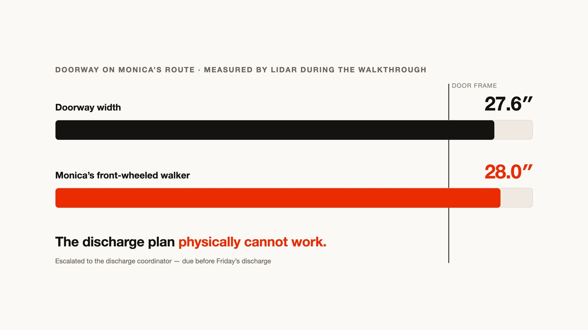

# SafeStep — verify the home before discharge


> *Monica's clinical team believes she may be ready to go home. SafeStep answers
> the question her chart cannot: **is her home ready for her?***

Every discharge plan ends with some version of *"discharge home once safe"* — but
nobody can verify "safe" from the chart. Falls after discharge are a leading
driver of readmissions; home-safety evaluations (CDC STEADI, HSSAT) exist but
need a clinician home visit that rarely happens. SafeStep turns any caregiver
with a LiDAR iPhone into that visit, run by an agent — and closes the loop back
into **Medplum (EHR / PIMS)** before the patient leaves.

**Medplum holds the chart. Twilio auto-texts the iPhone link. Vapi and/or ElevenLabs
runs Riley. SafeStep writes draft FHIR + Medicare coverage back to Medplum.**

## The demo story (chart → home → chart)

1. **Clinician portal (Medplum)** — Monica Hilpert, 76F: osteoporosis, deconditioned after a
   week in hospital + SNF rehab, lives alone, uses a 28-inch walker, going home
   Friday. Her encounter note's discharge-planning line is highlighted — *"formal
   pre-discharge assessment of … home setup"* — and handed to SafeStep. The chart
   agent reads Patient, Encounter, DocumentReference (discharge note + AVS).
2. **Twilio** — the moment the note is handed off, Twilio **automatically texts** the
   family (Maya, niece) a walkthrough link. Anyone at the home starts on any compatible
   iPhone.
3. **The walkthrough** — full-duplex voice (Riley via **Vapi and/or ElevenLabs** guides
   room to room, in *gathering mode*: neutral questions only, no hazard talk to
   laypeople), while three perception layers run: RoomPlan LiDAR (rooms, doorways,
   furniture — and live AR boxes on screen with YOLOv3 on the Neural Engine), a
   Claude Haiku fast-pass per camera frame (~1.3s) feeding Riley live scan events,
   and a Claude Sonnet deep-pass grading STEADI/HSSAT findings in the background.
   On-screen confirmation cards resolve by tap **or voice**.
4. **The verdict** — SafeStep scores every obligation it derived from the
   Medplum note against walkthrough evidence (`verified / at_risk / blocked / unverified`).
   The killer finding is a measurement, not a vibe: **"The bathroom doorway is 27.1 in.
   Monica's walker is 28. The discharge plan as written will not work."**

   
5. **Care-team review in Medplum** — drafted actions (clinical / operational / DME,
   each with owner + deadline + evidence + **HCPCS / Original Medicare vs MA coverage**)
   awaiting clinician approval, floor plans with the failing door drawn in red, the
   photo evidence filmstrip, and the full graded report. The care team **checks the
   records in Medplum** to see if insurance/Medicare covers each order. Approve →
   remediation verified → **chart updates: "VERIFIED, cleared for discharge."**

Nothing downstream of the camera is faked: every model call in the live engine demo
happens live. There is deliberately **no fabricated risk score** anywhere — findings are
graded against CDC STEADI / HSSAT items with per-patient rationale, and all
orders/escalations are **drafted, never auto-sent**.

## Architecture

```
iPhone (dumb client)                        Mac backend (all intelligence)
┌────────────────────────────┐           ┌────────────────────────────────────┐
│ RoomPlan LiDAR scan        │─ geometry ▶ /roomplan  walker-clearance math,  │
│  + live AR detection boxes │           │            floor-plan rendering    │
│ ARSession frames (2.5s)    │─ JPEG ────▶ /frame     Haiku fast-pass ──┐     │
│ Vapi and/or ElevenLabs     │           │            Sonnet deep-pass  │     │
│   voice (WebRTC)           │           │  events + measurements ◀─────┘     │
│ confirmation cards         │           │      ▼                             │
└──────────┬─────────────────┘           │ /v1/chat/completions  (SSE brain)  │
           │                             │ obligations engine ◀─ Medplum note │
  Vapi and/or ElevenLabs ─ custom LLM ──▶│ escalation router     + AVS        │
           (via ngrok)                   │ coverage (HCPCS / Medicare)        │
                                         │ /report · /approvals · FHIR drafts │
                                         │ POST Bundle → Medplum PIMS         │
                                         └────────────────────────────────────┘
Twilio Messages.create (auto) ── SMS link ──▶ family iPhone
```

- **One brain**: the Vapi / ElevenLabs agent's LLM *is* this backend — the same model
  that sees the camera events and the chart writes Riley's next sentence. Point the
  assistant webhook / custom-LLM URL at `https://<ngrok>/v1` (SSE).
- **Obligations engine**: derives post-encounter obligations from the encounter
  note + after-visit summary (Medplum artifacts), then scores each
  `verified / at_risk / blocked / unverified` against walkthrough evidence.
- **Escalation router**: deterministic rules → routed messages (expected /
  observed / why / attempted / next action + owner + deadline). Uncovered DME
  (Original Medicare) routes to social work.
- **FHIR write-back (draft)**: Observations (hazards), ServiceRequests (DME with
  HCPCS + Medicare coverage flags), Tasks (escalations), all tagged
  `DRAFT — requires clinician review`. Reviewers see coverage **in Medplum**.

See `backend/fhir_writeback.py` `DME_CATALOG` for E0241 / E0240 / E0244 / E0143 / E0163.

## Run it

```bash
# backend (Mac)
python3 -m venv .venv && .venv/bin/pip install -r backend/requirements.txt
cp .env.example .env          # ANTHROPIC_API_KEY, MEDPLUM_*, TWILIO_*, VAPI_ and/or ELEVENLABS_
cd backend && ../.venv/bin/uvicorn app:app --host 0.0.0.0 --port 8000

# voice plumbing: ngrok http 8000, then point a Vapi assistant webhook and/or
# an ElevenLabs conversational agent's custom-LLM URL at https://<ngrok>/v1  (SSE)

# iPhone (LiDAR)
cd iphone && ./fetch-models.sh   # on-device YOLOv3 (59 MB, not committed)
xcodegen generate && open Walkthrough.xcodeproj

# demo mode (no home needed): feed any walkthrough video through the real
# pipeline — backend/prepare_demo.py <video>, then "replay" in the app
```

Care-team surfaces: `http://<host>:8000/` (run index), `/report`, `/report/fhir`.
No backend handy? A fully rendered sample report (real walkthrough, 27 findings,
photos, floor plan) is committed at [docs/sample-report.html](docs/sample-report.html) —
download and open it in any browser.

## Built with

Claude (Haiku 4.5 fast-pass · Sonnet 5 deep-pass + voice brain) · Apple RoomPlan
& Core ML (YOLOv3) · Vapi and/or ElevenLabs Conversational AI · Twilio · FastAPI ·
FHIR R4 · CDC STEADI / HSSAT · Medplum PIMS.


